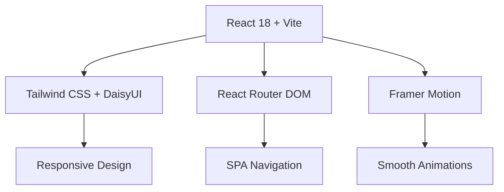
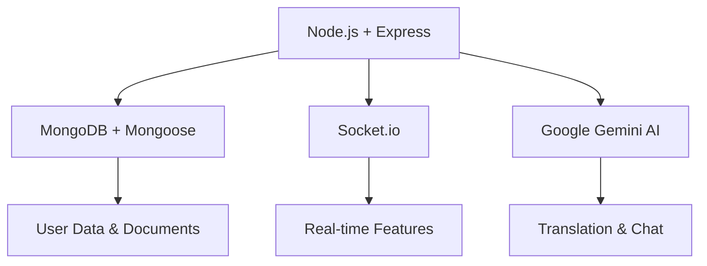

# 🌏 BanglaVerse - বাংলাভার্স

<div align="center">
  
  
  <h2>🚀 Your Complete Bangla Language Universe</h2>
  <p><em>AI-Powered Translation • Intelligent Chat • Content Creation • Language Learning</em></p>
  
  [](https://banglaverse.vercel.app/)
  [](https://youtu.be/enjSW7mZueA)
  [](https://github.com/Sabbir-Asif/Banglish_to_Bangla_Conversion_App)
  
  <br/>
  
  
  
  
  
  
  
</div>

---

> 🚨 **Having 404 deployment issues?** 
> 
> **Quick Fix:** Use **Netlify** instead of Vercel! 
> 
> ```bash
> cd Frontend && ./netlify-deploy.sh
> ```
> 
> **Or try our optimized Vercel deployment:**
> ```bash
> ./vercel-deploy.sh
> ```
> 
> Check our [**🚀 DEPLOYMENT_GUIDE.md**](DEPLOYMENT_GUIDE.md) | [**⚡ VERCEL_CONFIG.md**](VERCEL_CONFIG.md) | [**🏃 QUICK_FIX.md**](QUICK_FIX.md)

---

## 📖 Overview

**BanglaVerse** is a revolutionary AI-powered platform that transforms how people interact with the Bengali language. It seamlessly bridges the gap between Banglish (Bengali written in English script) and authentic Bengali, offering a comprehensive suite of tools for translation, conversation, content creation, and language learning.

### 🎯 **Mission Statement**
*To preserve, promote, and modernize the Bengali language through cutting-edge AI technology, making it accessible to Bengali speakers worldwide, regardless of their script proficiency.*

---

## ✨ Features

<div align="center">
  
| 🔥 **Core Features** | 🎨 **Creative Tools** | 🤖 **AI Features** | 👥 **Social Features** |
|---------------------|----------------------|-------------------|----------------------|
| Banglish → Bangla Translation | Document Editor | Smart Chatbot | User Profiles |
| Real-time Conversion | PDF Generation | Voice Recognition | Community Stories |
| Smart Spell Checker | Custom Fonts | Auto-correction | Content Sharing |
| Search Functionality | Rich Text Editor | Smart Suggestions | Collaborative Writing |

</div>

### � **Core Capabilities**

#### 1. **🔄 Advanced Translation Engine**
- **Banglish to Bangla**: Seamless conversion with context awareness
- **Real-time Processing**: Instant translation as you type
- **Smart Correction**: Auto-fixes common Banglish typing errors
- **Context Understanding**: Maintains meaning and cultural nuances

#### 2. **🤖 AI-Powered Chatbot**
- **Bilingual Support**: Understands both Banglish and Bengali
- **Natural Conversations**: Contextual responses in Bengali
- **Voice Integration**: Hands-free interaction capabilities
- **Continuous Learning**: Improves responses based on user interactions

#### 3. **📝 Content Creation Suite**
- **Rich Text Editor**: Create documents with Bengali typography
- **PDF Export**: Professional document generation with custom fonts
- **Auto-captioning**: AI-generated titles and descriptions
- **Template Library**: Pre-designed formats for various content types

#### 4. **🎓 Language Learning Tools**
- **Interactive Practice**: Learn proper Bengali script
- **Pronunciation Guide**: Audio support for correct pronunciation
- **Progress Tracking**: Monitor your language improvement journey
- **Cultural Context**: Learn about Bengali culture alongside language

#### 5. **👥 Community Features**
- **Story Sharing**: Publish and discover Bengali literature
- **Collaborative Writing**: Work together on documents
- **User Profiles**: Showcase your Bengali content portfolio
- **Community Feed**: Discover trending Bengali content

---

## �️ Technology Stack

<div align="center">

### **Frontend Architecture**


### **Backend Architecture**


</div>

| **Category** | **Technology** | **Purpose** |
|-------------|---------------|-------------|
| **Frontend** | React 18 + Vite | Modern, fast UI development |
| **Styling** | Tailwind CSS + DaisyUI | Responsive, beautiful designs |
| **State Management** | React Context + Hooks | Efficient state handling |
| **Animations** | Framer Motion + CSS | Smooth, engaging interactions |
| **Backend** | Node.js + Express.js | Robust server architecture |
| **Database** | MongoDB + Mongoose | Flexible document storage |
| **Authentication** | Firebase Auth | Secure user management |
| **AI Engine** | Google Gemini API | Advanced language processing |
| **Real-time** | Socket.io | Live chat and collaboration |
| **Deployment** | Vercel + MongoDB Atlas | Scalable cloud hosting |
| **Containerization** | Docker + Docker Compose | Consistent development environment |

---

## 🚀 Quick Start

### **Prerequisites**

Ensure you have the following installed:
- **Node.js** `v18+` ([Download](https://nodejs.org/))
- **MongoDB** ([Local](https://www.mongodb.com/try/download/community) or [Atlas](https://www.mongodb.com/cloud/atlas))
- **Git** ([Download](https://git-scm.com/))
- **Docker** (optional) ([Download](https://www.docker.com/))

### **🎬 One-Line Setup (Docker)**

```bash
git clone https://github.com/Sabbir-Asif/Banglish_to_Bangla_Conversion_App.git && cd Banglish_to_Bangla_Conversion_App && docker-compose up --build
```

### **💻 Manual Development Setup**

1. **Clone & Navigate**
   ```bash
   git clone https://github.com/Sabbir-Asif/Banglish_to_Bangla_Conversion_App.git
   cd Banglish_to_Bangla_Conversion_App
   ```

2. **Backend Setup**
   ```bash
   cd Backend
   npm install
   cp .env.example .env  # Configure your environment variables
   npm run dev
   ```

3. **Frontend Setup** (New Terminal)
   ```bash
   cd Frontend
   npm install
   cp .env.example .env  # Configure your environment variables
   npm run dev
   ```

4. **Database Setup** (New Terminal)
   ```bash
   # Using Docker (Recommended)
   docker run -d -p 27017:27017 --name banglaverse-mongo mongo:latest
   
   # OR using local MongoDB
   mongod
   ```

### **🔧 Environment Configuration**

#### **Backend (`.env`)**
```env
# Database
DB=mongodb://localhost:27017/banglaverse

# Server
PORT=3000

# AI Services
GOOGLE_API_KEY=your_google_gemini_api_key_here

# Security (Optional)
JWT_SECRET=your_jwt_secret_for_additional_auth
```

#### **Frontend (`.env`)**
```env
# API Configuration
VITE_API_URL=http://localhost:3000

# Firebase Configuration
VITE_FIREBASE_API_KEY=your_firebase_api_key
VITE_FIREBASE_AUTH_DOMAIN=your_project.firebaseapp.com
VITE_FIREBASE_PROJECT_ID=your_project_id
VITE_FIREBASE_STORAGE_BUCKET=your_project.appspot.com
VITE_FIREBASE_MESSAGING_SENDER_ID=your_sender_id
VITE_FIREBASE_APP_ID=your_app_id

# AI Services
VITE_GOOGLE_GEMINI_API_KEY=your_google_gemini_api_key_here
```

### **🔑 API Keys Setup**

1. **Google Gemini AI** ([Get API Key](https://aistudio.google.com/))
   - Visit Google AI Studio
   - Create a new API key
   - Add to both frontend and backend `.env` files

2. **Firebase** ([Setup Guide](https://firebase.google.com/))
   - Create a new Firebase project
   - Enable Authentication (Email/Password)
   - Get configuration from Project Settings
   - Add to frontend `.env` file

---

## 📱 Application Structure

```
BanglaVerse/
├── 📁 Frontend/                 # React Application
│   ├── 📁 src/
│   │   ├── 📁 Components/       # Reusable UI Components
│   │   │   ├── 📁 Chat/         # AI Chatbot Interface
│   │   │   ├── 📁 Translator/   # Translation Tools
│   │   │   ├── 📁 Document/     # Document Editor
│   │   │   ├── 📁 Stories/      # Community Stories
│   │   │   ├── 📁 Auth/         # Authentication
│   │   │   └── 📁 Dashboard/    # User & Admin Dashboards
│   │   ├── 📁 Pages/            # Main Application Pages
│   │   ├── 📁 Firebase/         # Firebase Configuration
│   │   └── 📁 Assets/           # Static Resources
│   ├── 📁 public/               # Public Assets
│   │   ├── 🖼️ logo.svg          # BanglaVerse Logo
│   │   ├── 🖼️ favicon.svg       # Browser Icon
│   │   └── 🔤 kalpurush.ttf     # Bengali Font
│   └── 📄 package.json
│
├── 📁 Backend/                  # Node.js API Server
│   ├── 📁 Chat/                 # Chatbot Logic
│   ├── 📁 Translation/          # Translation Services
│   ├── 📁 Document/             # Document Management
│   ├── 📁 User/                 # User Management
│   ├── 📁 TrainData/            # ML Training Data
│   ├── 📁 TempData/             # Temporary Storage
│   ├── 📁 tests/                # API Tests
│   ├── 📁 util/                 # Utility Functions
│   └── 📄 index.js              # Server Entry Point
│
├── 🐳 docker-compose.yml        # Container Orchestration
├── 📋 BRAND_GUIDELINES.md       # Brand Identity Guide
├── 📖 README.md                 # This Documentation
└── 🖼️ ER.jpg                   # Database Schema
```

---

## 🌐 Deployment

### **🎯 Recommended: Alternative Hosting (If Vercel 404 Issues)**

**If you're experiencing 404 errors on Vercel**, try these more reliable platforms for React SPAs:

#### 🌐 **Netlify (BEST CHOICE - Most Reliable)**
```bash
# Quick deployment script
cd Frontend
./netlify-deploy.sh

# Manual deployment:
# 1. Build: npm run build
# 2. Go to: https://app.netlify.com/drop
# 3. Drag and drop your 'dist' folder
# 4. Your app is live instantly!
```

#### 🔥 **Firebase Hosting**
```bash
cd Frontend
npm install -g firebase-tools
firebase login
firebase init hosting
npm run build
firebase deploy
```

#### ⚡ **Surge.sh (Super Fast)**
```bash
cd Frontend
npm install -g surge
npm run build
surge dist banglaverse.surge.sh
```

#### 🎨 **Render Static Sites**
1. Go to https://render.com
2. Connect your GitHub repository
3. Set build command: `npm run build`
4. Set publish directory: `dist`
5. Deploy!

### **📁 Multi-Platform Deployment Script**
```bash
cd Frontend
./multi-deploy.sh
# Interactive script to choose your preferred platform
```

### **🚀 Vercel Deployment (If you still want to try)**

1. **Clean deployment attempt:**
   ```bash
   cd Frontend
   rm -rf .vercel dist node_modules/.cache
   npm install
   npm run build
   vercel --prod
   ```

2. **Using the deployment script:**
   ```bash
   ./deploy.sh
   ```

### **⚡ Backend Deployment Options**

Choose from these reliable backend hosting platforms:

#### **Railway (Recommended)**
```bash
cd Backend
npm install -g @railway/cli
railway login
railway link
railway up
```

#### **Render**
1. Connect GitHub repository
2. Set build command: `npm install`
3. Set start command: `npm start`
4. Add environment variables

#### **Vercel (Node.js APIs)**
```bash
cd Backend
vercel --prod
```

### **🐳 Docker Production**

```bash
# Build and run in production mode
docker-compose -f docker-compose.prod.yml up --build
```

### **🔧 Environment Variables for Production**

**Important:** Set these in your hosting platform's dashboard:
- `VITE_API_URL`: Your backend API URL
- `VITE_FIREBASE_API_KEY`: Firebase configuration
- Database connection strings
- API keys (Google Gemini, etc.)
- CORS origins

---

## 🚨 Deployment Troubleshooting

### **Vercel 404 Error Fix**

If you're getting a `404: NOT_FOUND` error on Vercel, this is usually because of SPA (Single Page Application) routing issues. Here's how to fix it:

#### **Solution 1: Verify Vercel Configuration**

Make sure your `Frontend/vercel.json` is configured correctly:

```json
{
  "version": 2,
  "name": "banglaverse",
  "builds": [
    {
      "src": "package.json",
      "use": "@vercel/static-build",
      "config": {
        "distDir": "dist"
      }
    }
  ],
  "routes": [
    {
      "src": "/assets/(.*)",
      "dest": "/assets/$1"
    },
    {
      "src": "/logo.svg",
      "dest": "/logo.svg"
    },
    {
      "src": "/favicon.svg",
      "dest": "/favicon.svg"
    },
    {
      "src": "/(.*)",
      "dest": "/index.html"
    }
  ],
  "rewrites": [
    {
      "source": "/(.*)",
      "destination": "/index.html"
    }
  ]
}
```

#### **Solution 2: Check Build Configuration**

Ensure your `package.json` has the correct build script:

```json
{
  "scripts": {
    "dev": "vite",
    "build": "vite build",
    "vercel-build": "vite build",
    "preview": "vite preview"
  }
}
```

#### **Solution 3: Environment Variables**

Make sure all environment variables are set in Vercel Dashboard:

1. Go to your Vercel project dashboard
2. Navigate to **Settings** → **Environment Variables**
3. Add all required variables:
   ```
   VITE_API_URL=https://your-backend-url.vercel.app
   VITE_FIREBASE_API_KEY=your_firebase_api_key
   VITE_FIREBASE_AUTH_DOMAIN=your_project.firebaseapp.com
   VITE_FIREBASE_PROJECT_ID=your_project_id
   VITE_FIREBASE_STORAGE_BUCKET=your_project.appspot.com
   VITE_FIREBASE_MESSAGING_SENDER_ID=your_sender_id
   VITE_FIREBASE_APP_ID=your_app_id
   VITE_GOOGLE_GEMINI_API_KEY=your_google_gemini_api_key
   ```

#### **Solution 4: Deploy Steps**

1. **Clean Build** (locally):
   ```bash
   cd Frontend
   rm -rf dist node_modules package-lock.json
   npm install
   npm run build
   ```

2. **Vercel CLI Deployment**:
   ```bash
   npm install -g vercel
   cd Frontend
   vercel --prod
   ```

3. **GitHub Integration**:
   - Connect your repository to Vercel
   - Set build command: `npm run build`
   - Set output directory: `dist`
   - Set install command: `npm install`

#### **Solution 5: Common Issues**

| **Issue** | **Cause** | **Solution** |
|-----------|-----------|--------------|
| 404 on refresh | Missing SPA config | Update `vercel.json` rewrites |
| Build fails | Missing dependencies | Run `npm install` and check package.json |
| Environment errors | Missing env vars | Set all VITE_ variables in Vercel |
| Assets not loading | Wrong base path | Ensure `base: '/'` in vite.config.js |
| Route not found | Client-side routing | Verify React Router setup |

#### **Solution 6: Alternative Deployment Method**

If issues persist, try deploying using the Vercel dashboard:

1. **Import Project**: Go to Vercel dashboard → Import Project
2. **Select Repository**: Choose your GitHub repository
3. **Configure Project**:
   - Framework Preset: `Vite`
   - Root Directory: `Frontend`
   - Build Command: `npm run build`
   - Output Directory: `dist`
4. **Add Environment Variables**: Set all required VITE_ variables
5. **Deploy**: Click Deploy

#### **Solution 7: Debug Deployment**

To debug deployment issues:

1. **Check Build Logs**:
   ```bash
   vercel logs your-deployment-url
   ```

2. **Local Production Build**:
   ```bash
   npm run build
   npm run preview
   ```

3. **Verify Routes**:
   - Test all routes locally with `npm run preview`
   - Ensure all routes work with direct URL access

#### **Quick Deployment Commands**

```bash
# Quick deployment fix
cd Frontend
rm -rf dist
npm run build
vercel --prod

# Force redeploy
vercel --prod --force

# Check deployment status
vercel ls
```

### **Backend Deployment on Vercel**

For the backend, ensure your `Backend/vercel.json` is configured:

```json
{
  "version": 2,
  "builds": [
    {
      "src": "index.js",
      "use": "@vercel/node"
    }
  ],
  "routes": [
    {
      "src": "/(.*)",
      "dest": "index.js"
    }
  ],
  "env": {
    "DB": "@db",
    "GOOGLE_API_KEY": "@google_api_key"
  }
}
```

### **Production Checklist**

Before deploying, ensure:

- ✅ All environment variables are set
- ✅ API endpoints point to production backend
- ✅ Firebase is configured for production domain
- ✅ CORS is configured for production URLs
- ✅ Build runs successfully locally
- ✅ All routes work in preview mode

---

## 🌐 **Multiple Hosting Options for BanglaVerse**

### **🚀 Option 1: Vercel (Simplified Fix)**

**Step-by-Step Fix:**

1. **Delete existing deployment**:
   ```bash
   vercel rm your-project-name
   ```

2. **Use simplified vercel.json** (already updated):
   ```json
   {
     "rewrites": [
       {
         "source": "/(.*)",
         "destination": "/index.html"
       }
     ]
   }
   ```

3. **Deploy with specific settings**:
   ```bash
   cd Frontend
   rm -rf dist .vercel
   npm run build
   vercel --prod
   ```

4. **Manual Vercel Dashboard Setup**:
   - Go to [Vercel Dashboard](https://vercel.com/dashboard)
   - Click "Add New Project"
   - Import from GitHub
   - **Framework Preset**: `Other`
   - **Root Directory**: `Frontend`
   - **Build Command**: `npm run build`
   - **Output Directory**: `dist`
   - **Install Command**: `npm install`

---

### **🔥 Option 2: Netlify (Highly Recommended Alternative)**

Netlify often handles SPAs better than Vercel. Here's how to deploy:

1. **Create `_redirects` file**:
   ```bash
   echo "/*    /index.html   200" > Frontend/public/_redirects
   ```

2. **Build and deploy**:
   ```bash
   cd Frontend
   npm run build
   ```

3. **Deploy to Netlify**:
   - Go to [Netlify](https://app.netlify.com/)
   - Drag and drop your `dist` folder
   - Or connect GitHub repository
   - **Build command**: `npm run build`
   - **Publish directory**: `dist`

4. **Environment Variables** (in Netlify Dashboard):
   ```
   VITE_API_URL=https://your-backend.vercel.app
   VITE_FIREBASE_API_KEY=your_key
   VITE_FIREBASE_AUTH_DOMAIN=your_domain
   VITE_FIREBASE_PROJECT_ID=your_project_id
   VITE_FIREBASE_STORAGE_BUCKET=your_bucket
   VITE_FIREBASE_MESSAGING_SENDER_ID=your_sender_id
   VITE_FIREBASE_APP_ID=your_app_id
   VITE_GOOGLE_GEMINI_API_KEY=your_gemini_key
   ```

---

### **⚡ Option 3: Firebase Hosting (Google's Platform)**

Perfect for Firebase-integrated apps:

1. **Install Firebase CLI**:
   ```bash
   npm install -g firebase-tools
   ```

2. **Initialize Firebase**:
   ```bash
   cd Frontend
   firebase login
   firebase init hosting
   ```

3. **Configure `firebase.json`**:
   ```json
   {
     "hosting": {
       "public": "dist",
       "ignore": ["firebase.json", "**/.*", "**/node_modules/**"],
       "rewrites": [
         {
           "source": "**",
           "destination": "/index.html"
         }
       ]
     }
   }
   ```

4. **Deploy**:
   ```bash
   npm run build
   firebase deploy
   ```

---

### **🌊 Option 4: Surge.sh (Simple & Fast)**

Great for quick deployments:

1. **Install Surge**:
   ```bash
   npm install -g surge
   ```

2. **Build and deploy**:
   ```bash
   cd Frontend
   npm run build
   cd dist
   cp index.html 200.html  # For SPA routing
   surge --domain banglaverse.surge.sh
   ```

---

### **📦 Option 5: GitHub Pages**

Free hosting with GitHub:

1. **Install gh-pages**:
   ```bash
   cd Frontend
   npm install --save-dev gh-pages
   ```

2. **Update package.json**:
   ```json
   {
     "homepage": "https://yourusername.github.io/your-repo-name",
     "scripts": {
       "predeploy": "npm run build",
       "deploy": "gh-pages -d dist"
     }
   }
   ```

3. **Deploy**:
   ```bash
   npm run deploy
   ```

---

### **☁️ Option 6: Railway (Backend + Frontend)**

Perfect for full-stack deployment:

1. **Connect to Railway**:
   - Go to [Railway](https://railway.app/)
   - Connect GitHub repository
   - Create new project

2. **Configure Frontend**:
   - **Build Command**: `cd Frontend && npm install && npm run build`
   - **Start Command**: `cd Frontend && npm run preview`

3. **Configure Backend**:
   - **Build Command**: `cd Backend && npm install`
   - **Start Command**: `cd Backend && npm start`

---

### **🚀 Option 7: Render (Great Alternative)**

1. **Create account at [Render](https://render.com/)**

2. **Deploy Frontend**:
   - Connect GitHub repository
   - **Type**: Static Site
   - **Build Command**: `cd Frontend && npm install && npm run build`
   - **Publish Directory**: `Frontend/dist`

3. **Deploy Backend**:
   - **Type**: Web Service
   - **Build Command**: `cd Backend && npm install`
   - **Start Command**: `cd Backend && npm start`

---

### **🐳 Option 8: DigitalOcean App Platform**

1. **Create account at [DigitalOcean](https://www.digitalocean.com/)**

2. **App Platform Configuration**:
   ```yaml
   name: banglaverse
   services:
   - name: frontend
     source_dir: Frontend
     github:
       repo: your-username/your-repo
       branch: main
     build_command: npm run build
     output_dir: dist
     static_sites:
     - name: banglaverse-frontend
   
   - name: backend
     source_dir: Backend
     github:
       repo: your-username/your-repo
       branch: main
     build_command: npm install
     run_command: npm start
   ```

---

### **🎯 Quick Deployment Script for Multiple Platforms**

Let me create a deployment script that tries multiple platforms:

---

### **📊 Hosting Comparison**

| **Platform** | **Ease** | **Speed** | **Free Tier** | **SPA Support** | **Custom Domain** |
|-------------|----------|-----------|---------------|-----------------|-------------------|
| **Netlify** | ⭐⭐⭐⭐⭐ | ⭐⭐⭐⭐⭐ | ✅ 100GB | ✅ Excellent | ✅ Free |
| **Vercel** | ⭐⭐⭐⭐ | ⭐⭐⭐⭐⭐ | ✅ 100GB | ✅ Good | ✅ Free |
| **Firebase** | ⭐⭐⭐⭐ | ⭐⭐⭐⭐ | ✅ 10GB | ✅ Excellent | ✅ Free |
| **Railway** | ⭐⭐⭐ | ⭐⭐⭐⭐ | ✅ 500h/month | ✅ Good | ✅ Free |
| **Render** | ⭐⭐⭐⭐ | ⭐⭐⭐ | ✅ 750h/month | ✅ Good | ✅ Free |
| **Surge** | ⭐⭐⭐⭐⭐ | ⭐⭐⭐ | ✅ Unlimited | ✅ Basic | ✅ Free |

---

### **🎯 My Recommendations**

**For Immediate Success:**
1. **Netlify** - Most reliable for React SPAs
2. **Firebase Hosting** - Perfect for Firebase apps
3. **Surge.sh** - Quickest deployment

**For Full-Stack:**
1. **Railway** - Frontend + Backend together
2. **Render** - Good free tier
3. **DigitalOcean** - Professional grade

---
