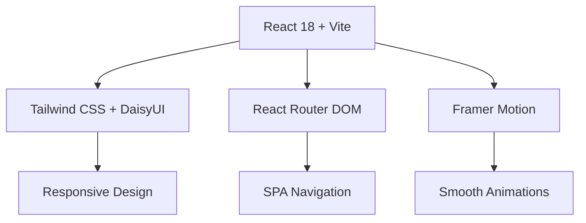
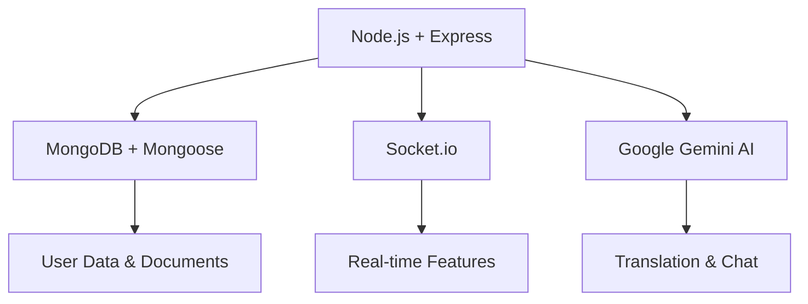

# 🌏 BanglaVerse - বাংলাভার্স

<div align="center">
  
  
  <h2>🚀 Your Complete Bangla Language Universe</h2>
  <p><em>AI-Powered Translation • Intelligent Chat • Content Creation • Language Learning</em></p>
  
  [](https://banglish-to-bangla-conversion-app-rh41.vercel.app/)
  [](https://youtu.be/enjSW7mZueA)
  [](https://github.com/Sabbir-Asif/Banglish_to_Bangla_Conversion_App)
  
  <br/>
  
  
  
  
  
  
  
</div>

---

## 📖 Overview

**BanglaVerse** is a revolutionary AI-powered platform that transforms how people interact with the Bengali language. It seamlessly bridges the gap between Banglish (Bengali written in English script) and authentic Bengali, offering a comprehensive suite of tools for translation, conversation, content creation, and language learning.

### 🎯 **Mission Statement**
*To preserve, promote, and modernize the Bengali language through cutting-edge AI technology, making it accessible to Bengali speakers worldwide, regardless of their script proficiency.*

---

## ✨ Features

<div align="center">
  
| 🔥 **Core Features** | 🎨 **Creative Tools** | 🤖 **AI Features** | 👥 **Social Features** |
|---------------------|----------------------|-------------------|----------------------|
| Banglish → Bangla Translation | Document Editor | Smart Chatbot | User Profiles |
| Real-time Conversion | PDF Generation | Voice Recognition | Community Stories |
| Smart Spell Checker | Custom Fonts | Auto-correction | Content Sharing |
| Search Functionality | Rich Text Editor | Smart Suggestions | Collaborative Writing |

</div>

### � **Core Capabilities**

#### 1. **🔄 Advanced Translation Engine**
- **Banglish to Bangla**: Seamless conversion with context awareness
- **Real-time Processing**: Instant translation as you type
- **Smart Correction**: Auto-fixes common Banglish typing errors
- **Context Understanding**: Maintains meaning and cultural nuances

#### 2. **🤖 AI-Powered Chatbot**
- **Bilingual Support**: Understands both Banglish and Bengali
- **Natural Conversations**: Contextual responses in Bengali
- **Voice Integration**: Hands-free interaction capabilities
- **Continuous Learning**: Improves responses based on user interactions

#### 3. **📝 Content Creation Suite**
- **Rich Text Editor**: Create documents with Bengali typography
- **PDF Export**: Professional document generation with custom fonts
- **Auto-captioning**: AI-generated titles and descriptions
- **Template Library**: Pre-designed formats for various content types

#### 4. **🎓 Language Learning Tools**
- **Interactive Practice**: Learn proper Bengali script
- **Pronunciation Guide**: Audio support for correct pronunciation
- **Progress Tracking**: Monitor your language improvement journey
- **Cultural Context**: Learn about Bengali culture alongside language

#### 5. **👥 Community Features**
- **Story Sharing**: Publish and discover Bengali literature
- **Collaborative Writing**: Work together on documents
- **User Profiles**: Showcase your Bengali content portfolio
- **Community Feed**: Discover trending Bengali content

---

## �️ Technology Stack

<div align="center">

### **Frontend Architecture**


### **Backend Architecture**


</div>

| **Category** | **Technology** | **Purpose** |
|-------------|---------------|-------------|
| **Frontend** | React 18 + Vite | Modern, fast UI development |
| **Styling** | Tailwind CSS + DaisyUI | Responsive, beautiful designs |
| **State Management** | React Context + Hooks | Efficient state handling |
| **Animations** | Framer Motion + CSS | Smooth, engaging interactions |
| **Backend** | Node.js + Express.js | Robust server architecture |
| **Database** | MongoDB + Mongoose | Flexible document storage |
| **Authentication** | Firebase Auth | Secure user management |
| **AI Engine** | Google Gemini API | Advanced language processing |
| **Real-time** | Socket.io | Live chat and collaboration |
| **Deployment** | Vercel + MongoDB Atlas | Scalable cloud hosting |
| **Containerization** | Docker + Docker Compose | Consistent development environment |

---

## 🚀 Quick Start

### **Prerequisites**

Ensure you have the following installed:
- **Node.js** `v18+` ([Download](https://nodejs.org/))
- **MongoDB** ([Local](https://www.mongodb.com/try/download/community) or [Atlas](https://www.mongodb.com/cloud/atlas))
- **Git** ([Download](https://git-scm.com/))
- **Docker** (optional) ([Download](https://www.docker.com/))

### **🎬 One-Line Setup (Docker)**

```bash
git clone https://github.com/Sabbir-Asif/Banglish_to_Bangla_Conversion_App.git && cd Banglish_to_Bangla_Conversion_App && docker-compose up --build
```

### **💻 Manual Development Setup**

1. **Clone & Navigate**
   ```bash
   git clone https://github.com/Sabbir-Asif/Banglish_to_Bangla_Conversion_App.git
   cd Banglish_to_Bangla_Conversion_App
   ```

2. **Backend Setup**
   ```bash
   cd Backend
   npm install
   cp .env.example .env  # Configure your environment variables
   npm run dev
   ```

3. **Frontend Setup** (New Terminal)
   ```bash
   cd Frontend
   npm install
   cp .env.example .env  # Configure your environment variables
   npm run dev
   ```

4. **Database Setup** (New Terminal)
   ```bash
   # Using Docker (Recommended)
   docker run -d -p 27017:27017 --name banglaverse-mongo mongo:latest
   
   # OR using local MongoDB
   mongod
   ```

### **🔧 Environment Configuration**

#### **Backend (`.env`)**
```env
# Database
DB=mongodb://localhost:27017/banglaverse

# Server
PORT=3000

# AI Services
GOOGLE_API_KEY=your_google_gemini_api_key_here

# Security (Optional)
JWT_SECRET=your_jwt_secret_for_additional_auth
```

#### **Frontend (`.env`)**
```env
# API Configuration
VITE_API_URL=http://localhost:3000

# Firebase Configuration
VITE_FIREBASE_API_KEY=your_firebase_api_key
VITE_FIREBASE_AUTH_DOMAIN=your_project.firebaseapp.com
VITE_FIREBASE_PROJECT_ID=your_project_id
VITE_FIREBASE_STORAGE_BUCKET=your_project.appspot.com
VITE_FIREBASE_MESSAGING_SENDER_ID=your_sender_id
VITE_FIREBASE_APP_ID=your_app_id

# AI Services
VITE_GOOGLE_GEMINI_API_KEY=your_google_gemini_api_key_here
```

### **🔑 API Keys Setup**

1. **Google Gemini AI** ([Get API Key](https://aistudio.google.com/))
   - Visit Google AI Studio
   - Create a new API key
   - Add to both frontend and backend `.env` files

2. **Firebase** ([Setup Guide](https://firebase.google.com/))
   - Create a new Firebase project
   - Enable Authentication (Email/Password)
   - Get configuration from Project Settings
   - Add to frontend `.env` file

---

## 📱 Application Structure

```
BanglaVerse/
├── 📁 Frontend/                 # React Application
│   ├── 📁 src/
│   │   ├── 📁 Components/       # Reusable UI Components
│   │   │   ├── 📁 Chat/         # AI Chatbot Interface
│   │   │   ├── 📁 Translator/   # Translation Tools
│   │   │   ├── 📁 Document/     # Document Editor
│   │   │   ├── 📁 Stories/      # Community Stories
│   │   │   ├── 📁 Auth/         # Authentication
│   │   │   └── 📁 Dashboard/    # User & Admin Dashboards
│   │   ├── 📁 Pages/            # Main Application Pages
│   │   ├── 📁 Firebase/         # Firebase Configuration
│   │   └── 📁 Assets/           # Static Resources
│   ├── 📁 public/               # Public Assets
│   │   ├── 🖼️ logo.svg          # BanglaVerse Logo
│   │   ├── 🖼️ favicon.svg       # Browser Icon
│   │   └── 🔤 kalpurush.ttf     # Bengali Font
│   └── 📄 package.json
│
├── 📁 Backend/                  # Node.js API Server
│   ├── 📁 Chat/                 # Chatbot Logic
│   ├── 📁 Translation/          # Translation Services
│   ├── 📁 Document/             # Document Management
│   ├── 📁 User/                 # User Management
│   ├── 📁 TrainData/            # ML Training Data
│   ├── 📁 TempData/             # Temporary Storage
│   ├── 📁 tests/                # API Tests
│   ├── 📁 util/                 # Utility Functions
│   └── 📄 index.js              # Server Entry Point
│
├── 🐳 docker-compose.yml        # Container Orchestration
├── 📋 BRAND_GUIDELINES.md       # Brand Identity Guide
├── 📖 README.md                 # This Documentation
└── 🖼️ ER.jpg                   # Database Schema
```

---

## 🌐 Deployment

### **🚀 Production Deployment (Vercel)**

1. **Frontend Deployment**
   ```bash
   cd Frontend
   npm run build
   vercel --prod
   ```

2. **Backend Deployment**
   ```bash
   cd Backend
   vercel --prod
   ```

3. **Database Hosting**
   - Use [MongoDB Atlas](https://www.mongodb.com/cloud/atlas) for production
   - Update connection string in backend `.env`

### **🐳 Docker Production**

```bash
# Build and run in production mode
docker-compose -f docker-compose.prod.yml up --build
```

### **🔧 Environment Variables for Production**

Ensure all production environment variables are properly configured:
- Database connection strings
- API keys
- CORS origins
- Security tokens

---

## 📊 API Documentation

### **🔗 Base URLs**
- **Development**: `http://localhost:3000`
- **Production**: `https://your-backend-domain.vercel.app`

### **🔐 Authentication Endpoints**

| Method | Endpoint | Description |
|--------|----------|-------------|
| `POST` | `/api/auth/register` | User registration |
| `POST` | `/api/auth/login` | User login |
| `POST` | `/api/auth/logout` | User logout |
| `GET` | `/api/auth/profile` | Get user profile |

### **🔄 Translation Endpoints**

| Method | Endpoint | Description |
|--------|----------|-------------|
| `POST` | `/api/translate` | Banglish to Bangla translation |
| `POST` | `/api/translate/batch` | Bulk translation |
| `GET` | `/api/translate/history` | Translation history |

### **🤖 Chat Endpoints**

| Method | Endpoint | Description |
|--------|----------|-------------|
| `POST` | `/api/chat/message` | Send message to AI |
| `GET` | `/api/chat/history` | Chat conversation history |
| `DELETE` | `/api/chat/clear` | Clear chat history |

### **📄 Document Endpoints**

| Method | Endpoint | Description |
|--------|----------|-------------|
| `POST` | `/api/documents` | Create new document |
| `GET` | `/api/documents` | Get user documents |
| `PUT` | `/api/documents/:id` | Update document |
| `DELETE` | `/api/documents/:id` | Delete document |
| `POST` | `/api/documents/:id/pdf` | Generate PDF |

---

## 🧪 Testing

### **🔍 Running Tests**

```bash
# Backend API Tests
cd Backend
npm test

# Frontend Component Tests (if implemented)
cd Frontend
npm test

# End-to-End Tests
npm run test:e2e
```

### **🧪 Test Coverage**

- ✅ Authentication flows
- ✅ Translation accuracy
- ✅ Document CRUD operations
- ✅ Chat functionality
- ✅ API error handling

---

## 🤝 Contributing

We welcome contributions to BanglaVerse! Here's how you can help:

### **� Bug Reports**
- Use the [GitHub Issues](https://github.com/Sabbir-Asif/Banglish_to_Bangla_Conversion_App/issues) page
- Provide detailed reproduction steps
- Include browser/device information

### **🚀 Feature Requests**
- Discuss new features in [GitHub Discussions](https://github.com/Sabbir-Asif/Banglish_to_Bangla_Conversion_App/discussions)
- Explain the use case and expected behavior
- Consider backward compatibility

### **💡 Development Workflow**

1. **Fork the Repository**
   ```bash
   git fork https://github.com/Sabbir-Asif/Banglish_to_Bangla_Conversion_App.git
   ```

2. **Create Feature Branch**
   ```bash
   git checkout -b feature/amazing-feature
   ```

3. **Make Changes & Test**
   ```bash
   # Make your changes
   npm test
   npm run lint
   ```

4. **Commit & Push**
   ```bash
   git commit -m "feat: add amazing feature"
   git push origin feature/amazing-feature
   ```

5. **Create Pull Request**
   - Describe your changes clearly
   - Include screenshots if applicable
   - Reference related issues

### **📝 Coding Standards**

- **JavaScript**: Follow ESLint configuration
- **React**: Use functional components with hooks
- **CSS**: Use Tailwind CSS classes
- **Commits**: Follow [Conventional Commits](https://www.conventionalcommits.org/)

---

## 📈 Roadmap

### **🎯 Current Version (v1.0)**
- ✅ Core translation functionality
- ✅ AI chatbot integration
- ✅ Document editor
- ✅ User authentication
- ✅ Story sharing platform

### **� Upcoming Features (v1.1)**
- 🔄 Voice input/output
- 🔄 Mobile app (React Native)
- 🔄 Offline mode
- 🔄 Advanced analytics dashboard
- 🔄 Multi-language support

### **🌟 Future Vision (v2.0)**
- 🎯 Machine learning improvements
- 🎯 Real-time collaboration
- 🎯 Educational curriculum
- 🎯 Enterprise features
- 🎯 API marketplace

---

## 📞 Support & Community

### **💬 Get Help**
- 📧 **Email**: [support@banglaverse.com](mailto:support@banglaverse.com)
- 💬 **Discord**: [Join our community](https://discord.gg/banglaverse)
- 🐛 **Issues**: [GitHub Issues](https://github.com/Sabbir-Asif/Banglish_to_Bangla_Conversion_App/issues)
- 📖 **Documentation**: [Wiki](https://github.com/Sabbir-Asif/Banglish_to_Bangla_Conversion_App/wiki)

### **🌐 Social Media**
- 🐦 **Twitter**: [@BanglaVerse](https://twitter.com/banglaverse)
- 📘 **Facebook**: [BanglaVerse Community](https://facebook.com/banglaverse)
- 💼 **LinkedIn**: [BanglaVerse](https://linkedin.com/company/banglaverse)

---

## 📄 License

This project is licensed under the **MIT License** - see the [LICENSE](LICENSE) file for details.

```
MIT License

Copyright (c) 2025 BanglaVerse Team

Permission is hereby granted, free of charge, to any person obtaining a copy
of this software and associated documentation files (the "Software"), to deal
in the Software without restriction, including without limitation the rights
to use, copy, modify, merge, publish, distribute, sublicense, and/or sell
copies of the Software, and to permit persons to whom the Software is
furnished to do so, subject to the following conditions:

The above copyright notice and this permission notice shall be included in all
copies or substantial portions of the Software.
```

---

## 🙏 Acknowledgments

- **Google Gemini AI** for powerful language processing capabilities
- **Firebase** for robust authentication and hosting
- **MongoDB** for flexible document storage
- **Vercel** for seamless deployment experience
- **Bengali Language Community** for inspiration and cultural guidance
- **Open Source Contributors** who make projects like this possible

---

<div align="center">
  
### 🌟 **Star this repository if you find BanglaVerse helpful!**

[](https://github.com/Sabbir-Asif/Banglish_to_Bangla_Conversion_App)
[](https://github.com/Sabbir-Asif/Banglish_to_Bangla_Conversion_App)
[](https://github.com/Sabbir-Asif/Banglish_to_Bangla_Conversion_App)

**Made with ❤️ for the Bengali language community**

*BanglaVerse - Preserving Heritage, Embracing Technology*

</div>
   ```

2. **Install Backend Dependencies:**
   ```bash
   cd Backend
   npm install
   ```

3. **Install Frontend Dependencies:**
   ```bash
   cd ../Frontend
   npm install
   ```

### Option 2: Docker Setup (Quick Start)

1. **Clone the repository:**
   ```bash
   git clone https://github.com/Sabbir-Asif/Banglish_to_Bangla_Conversion_App.git
   cd Banglish_to_Bangla_Conversion_App
   ```

2. **Run with Docker Compose:**
   ```bash
   docker-compose up --build
   ```

## 🔧 Configuration

### Backend Configuration

1. **Create environment file:**
   ```bash
   cd Backend
   touch .env
   ```

2. **Add the following environment variables to `Backend/.env`:**
   ```env
   # Database Configuration
   DB=mongodb://localhost:27017/banglish_to_bangla
   
   # Server Configuration
   PORT=3000
   
   # Google Gemini API Key (Get from: https://makersuite.google.com/app/apikey)
   GOOGLE_API_KEY=your_google_gemini_api_key_here
   ```

### Frontend Configuration

1. **Create environment file:**
   ```bash
   cd Frontend
   touch .env
   ```

2. **Add the following environment variables to `Frontend/.env`:**
   ```env
   # API Configuration
   VITE_API_URL=http://localhost:3000
   
   # Firebase Configuration (Get from Firebase Console)
   VITE_FIREBASE_API_KEY=your_firebase_api_key
   VITE_FIREBASE_AUTH_DOMAIN=your_project_id.firebaseapp.com
   VITE_FIREBASE_PROJECT_ID=your_project_id
   VITE_FIREBASE_STORAGE_BUCKET=your_project_id.firebasestorage.app
   VITE_FIREBASE_MESSAGING_SENDER_ID=your_messaging_sender_id
   VITE_FIREBASE_APP_ID=your_app_id
   
   # Google Gemini API Key (same as backend)
   VITE_GOOGLE_API_KEY=your_google_gemini_api_key_here
   ```

## ▶️ Running the Application

### Start MongoDB (if running locally)
```bash
# Option 1: Using Docker
docker run -d -p 27017:27017 --name mongodb mongo:latest

# Option 2: Using local MongoDB installation
mongod
```

### Start Backend Server
```bash
cd Backend
npm run dev
```
Backend will be available at: `http://localhost:3000`

### Start Frontend Server
```bash
cd Frontend
npm run dev
```
Frontend will be available at: `http://localhost:5173`

### Access Points
- **Frontend Application**: http://localhost:5173
- **Backend API**: http://localhost:3000
- **API Documentation**: http://localhost:3000/api-docs
- **MongoDB**: mongodb://localhost:27017

## 🐳 Docker Setup

### Using Docker Compose (Recommended)

1. **Run the entire application stack:**
   ```bash
   docker-compose up --build
   ```

2. **Access Points:**
   - Frontend: http://localhost:8080
   - Backend: http://localhost:3000
   - MongoDB: mongodb://localhost:27017

3. **Stop the application:**
   ```bash
   docker-compose down
   ```

### Individual Docker Commands

**Backend:**
```bash
cd Backend
docker build -t banglish-backend .
docker run -p 3000:3000 banglish-backend
```

**Frontend:**
```bash
cd Frontend
docker build -t banglish-frontend .
docker run -p 8080:80 banglish-frontend
```

## 🔥 Firebase Setup

### Step 1: Create Firebase Project
1. Go to [Firebase Console](https://console.firebase.google.com/)
2. Click "Create a project"
3. Enter project name (e.g., "banglish-to-bangla-app")
4. Follow the setup wizard

### Step 2: Enable Authentication
1. In Firebase Console, go to **Authentication**
2. Click **Get started**
3. Go to **Sign-in method** tab
4. Enable **Email/Password** authentication
5. Optionally enable **Google** sign-in

### Step 3: Create Web App
1. Click the gear icon ⚙️ (Project settings)
2. Scroll to **Your apps** section
3. Click the web icon `</>`
4. Register your app with a nickname
5. Copy the configuration object

### Step 4: Set up Firestore (Optional)
1. Go to **Firestore Database**
2. Click **Create database**
3. Choose **Start in test mode**
4. Select a location (e.g., `us-central1`)

### Step 5: Update Environment Variables
Update your `Frontend/.env` file with the Firebase configuration values.

## 🗄️ Database Setup

### MongoDB Setup Options

#### Option 1: Local MongoDB
1. Install MongoDB locally
2. Start MongoDB service
3. Use connection string: `mongodb://localhost:27017/banglish_to_bangla`

#### Option 2: MongoDB Atlas (Cloud)
1. Create account at [MongoDB Atlas](https://www.mongodb.com/cloud/atlas)
2. Create a new cluster
3. Get connection string
4. Update `DB` variable in `Backend/.env`

#### Option 3: Docker MongoDB
```bash
docker run -d -p 27017:27017 --name mongodb mongo:latest
```

### Database Collections
The application automatically creates the following collections:
- `users` - User profiles and authentication data
- `documents` - User-created documents and stories
- `traindata` - Training data for AI models
- `tempdata` - Temporary data for pending approvals

## 📝 API Documentation

Once the backend is running, you can access the API documentation at:
- **Swagger UI**: http://localhost:3000/api-docs

### Main API Endpoints

#### Authentication & Users
- `POST /api/users` - Create new user
- `GET /api/users/search` - Search users by email
- `PUT /api/users/:id` - Update user profile

#### Documents
- `GET /api/documents` - Get all documents
- `POST /api/documents` - Create new document
- `GET /api/documents/:id` - Get specific document
- `PUT /api/documents/:id` - Update document

#### Training Data
- `GET /api/trainData` - Get training data
- `POST /api/trainData` - Add training data

#### Temporary Data
- `GET /api/tempData` - Get temporary data
- `POST /api/tempData` - Submit data for approval

## 🎯 Goals

- Enhance communication and content creation in authentic Bangla
- Simplify the learning of Bangla expressions
- Bridge cultural and linguistic gaps through technology

## 🔑 Getting API Keys

### Google Gemini API Key
1. Visit [Google AI Studio](https://makersuite.google.com/app/apikey)
2. Sign in with your Google account
3. Click "Create API Key"
4. Copy the generated API key
5. Add it to both `Backend/.env` and `Frontend/.env`

### Firebase Configuration
1. Complete the Firebase setup steps above
2. Get your configuration from Firebase Console
3. Update the environment variables accordingly

## 🚨 Troubleshooting

### Common Issues

#### Firebase Authentication Error
```
Error: Firebase: Error (auth/api-key-not-valid)
```
**Solution**: Ensure your Firebase API key is correctly set in `Frontend/.env`

#### Database Connection Error
```
Could not connect database!
```
**Solution**: 
- Check if MongoDB is running
- Verify the `DB` connection string in `Backend/.env`
- Ensure the database URL is accessible

#### Port Already in Use
```
Port 3000 is already in use
```
**Solution**:
- Kill the process using the port: `lsof -ti:3000 | xargs kill -9`
- Or change the port in `Backend/.env`

#### Module Not Found Errors
```
Cannot find module
```
**Solution**:
- Delete `node_modules` and `package-lock.json`
- Run `npm install` again

### Development Tips

1. **Hot Reload**: Both frontend and backend support hot reload during development
2. **API Testing**: Use the Swagger documentation at `http://localhost:3000/api-docs`
3. **Database Inspection**: Use MongoDB Compass to inspect your database
4. **Environment Variables**: Restart the servers after changing `.env` files

## 📚 Project Structure

```
Banglish_to_Bangla_Conversion_App/
├── Backend/
│   ├── Chat/              # Chat functionality
│   ├── Document/          # Document management
│   ├── TempData/          # Temporary data handling
│   ├── TrainData/         # Training data management
│   ├── User/              # User management
│   ├── util/              # Utility functions
│   ├── tests/             # API tests
│   ├── index.js           # Main server file
│   ├── package.json       # Backend dependencies
│   └── .env               # Backend environment variables
├── Frontend/
│   ├── src/
│   │   ├── Components/    # React components
│   │   ├── Pages/         # Page components
│   │   ├── Firebase/      # Firebase configuration
│   │   └── assets/        # Static assets
│   ├── public/            # Public assets
│   ├── package.json       # Frontend dependencies
│   └── .env               # Frontend environment variables
├── docker-compose.yml     # Docker orchestration
└── README.md             # This file
```

## 🧪 Testing

### Backend Testing
```bash
cd Backend
npm test
```

### Frontend Testing
```bash
cd Frontend
npm run test
```

### API Testing
- Use the Swagger UI at `http://localhost:3000/api-docs`
- Import the API collection into Postman
- Test endpoints manually using curl or Insomnia

## 🚀 Deployment

### Vercel Deployment (Frontend)
1. Connect your GitHub repository to Vercel
2. Set environment variables in Vercel dashboard
3. Deploy automatically on push to main branch

### Backend Deployment Options
- **Vercel**: Use `vercel.json` configuration
- **Heroku**: Add `Procfile` and deploy
- **Railway**: Connect GitHub and deploy
- **DigitalOcean**: Use App Platform

### Environment Variables for Production
Make sure to set all environment variables in your production environment:
- API URLs should point to production backends
- Use production MongoDB databases
- Set secure Firebase configuration

## 📊 System Diagrams

### Database Schema


### System Workflows


## 📸 Application Screenshots

### Home Page


### AI Assistant


### Translation Interface


### Content Creation


### Smart Correction


## 🤝 Contributing

1. Fork the repository
2. Create a new branch: `git checkout -b feature-name`
3. Commit your changes: `git commit -m "Add some feature"`
4. Push to the branch: `git push origin feature-name`
5. Submit a pull request

## 📄 License

This project is licensed under the MIT License - see the [LICENSE](LICENSE) file for details.

## 👥 Authors

- **Original Developer** - [Sabbir-Asif](https://github.com/Sabbir-Asif)
- **Contributors** - See [Contributors](https://github.com/Sabbir-Asif/Banglish_to_Bangla_Conversion_App/contributors)

## 🙏 Acknowledgments

- Thanks to Google Gemini AI for providing translation capabilities
- Firebase for authentication services
- MongoDB for database solutions
- The open-source community for various packages and tools

## 📞 Support

If you encounter any issues or have questions:

1. Check the [Troubleshooting](#-troubleshooting) section
2. Look through existing [Issues](https://github.com/Sabbir-Asif/Banglish_to_Bangla_Conversion_App/issues)
3. Create a new issue if your problem isn't covered

## 🔄 Version History

- **v1.0.0** - Initial release with core translation features
- **v1.1.0** - Added chat functionality and real-time collaboration
- **v1.2.0** - Enhanced UI/UX and added PDF export features

---

**Made with ❤️ for the Bangla-speaking community**
